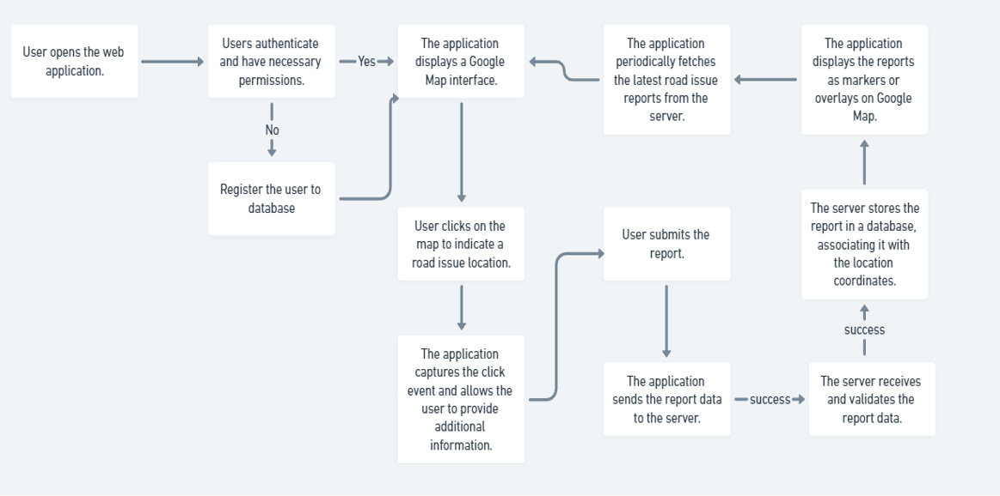

# Code-with-Google-Maps-2023 - Hack2skill

Welcome to the official repository for the Code-with-Google-Maps-2023 organized by Hack2skill!

## Getting Started

To get started with the Code-with-Google-Maps-2023 repository, follow these steps:

### Submission Instruction:

1. Fork this repository
2. Create a folder with your Team Name
3. Upload all the code and necessary files in the created folder
4. Upload a **README.md** file in your folder with the below mentioned informations.
5. Generate a Pull Request with your Team Name. (Example: submission-XYZ_team)

### README.md must consist of the following information:

#### Team Name - Tech Buddy

#### Problem Statement - Real-Time Road Blockage Reporting System with Google

#### Team Leader Email - btushar301@gmail.com

### A Brief of the Prototype:

This section must include UML Diagrams and prototype description
_Description_:
The RoadSafety Web Application Prototype aims to enhance road safety and improve traffic management by allowing users to report road blockages, faults, and other issues in real-time. This application utilizes the Google Maps API to provide a user-friendly interface for reporting and viewing road incidents. It promotes community engagement and enables efficient incident reporting.
_Key Features_:

1. _Real-Time Incident Reporting_: Users can report road incidents such as potholes, accidents, roadblocks, and other issues through the application. The location and details of the incident are captured through Google Maps Api.

2. _Interactive Map Interface_: The application integrates Google Maps to provide a familiar and intuitive map interface. Users can easily pinpoint the location of incidents and view the map interactively.

3. _Custom Markers_: Users can mark incidents on the map using custom markers, making it easy to identify the type and location of each incident.

4. _Community Engagement_: The platform encourages community engagement by allowing users to contribute to road safety. It fosters a sense of responsibility and collaboration among users.

5. _Route Planning_: Users can plan routes, view traffic conditions, and receive real-time traffic updates to ensure safe and efficient travel.

### Tech Stack:

HTML
CSS
JAVASCRIPT
REACT
NODE
EXPRESS JS
PASSPORT JS
GOOGLE MAPS API
mongoDB
CHAKRA UI

### Step-by-Step Code Execution Instructions:

This Section must contain a set of instructions required to clone and run the prototype so that it can be tested and deeply analyzed

git clone 

cd RoadSafety

cd backend

npm install

node index.js

creating .env

PORT=8800
MONGO="mongodb+srv://<YOUR_MONGODB_NAME>:<PASSWORD>@cluster0.liyyi8h.mongodb.net/RoadSafety?retryWrites=true&w=majority"
GOOGLE_CLIENT_ID="YOUR_GOOGLE_ID"
GOOGLE_CLIENT_SECRET="YOUR_GOOGLE_SECRET"

MUST CONTAIN THE ACCESS FOR AUTH0

cd frontend

npm install 

npm start

CREATING .ENV FILE

### Future Scope:

Write about the scalability and futuristic aspects of the prototype developed
